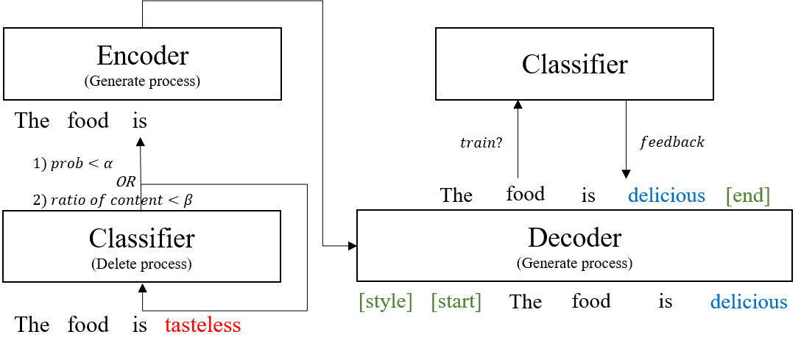

# Stable Style Transformer with Classifier for Text Style Transfer (INLG 2020)

The overall flow of our model

## Requirements
1. Pytorch 1.2+
2. Python 3.5+
3. [Huggingface Transformer](https://github.com/huggingface/transformers)
4. [BERTScore](https://pypi.org/project/bert-score/)

<br>Basically, the code is supposed to run in the GPU environment.</br>
If you do not have a GPU, it is recommended to modify the code and use it in a CPU environment.
By default, the folder path is an absolute path, so please set the root according to your settings.

## Datasets
1. [Yelp and Amazon Dataset](https://github.com/lijuncen/Sentiment-and-Style-Transfer)
2. [Human reference-DRG](https://github.com/lijuncen/Sentiment-and-Style-Transfer/tree/master/data)
3. [Human reference-DualRL](https://github.com/luofuli/DualRL/tree/master/references)

## Train
Description based on the yelp dataset  
```bash
cd generation_model/yelp
```
### Step 1: Train classifier
```bash
cd classifier
python3 train.py
```
### Step 2: Train generator
```bash
python3 train.py
```
## Evaluation
### Step 1: Finetune GPT
```bash
cd gpt2/yelp
python3 train.py
```
### Step 2: Evaluate models with 4 metrics
```bash
cd evaluation/yelp/my_model/SST/
```
Check out *generalization_eval_new.ipynb*  
Systems are evaluated using BLEU, classification accuracy, PPL, and BERTscore.
